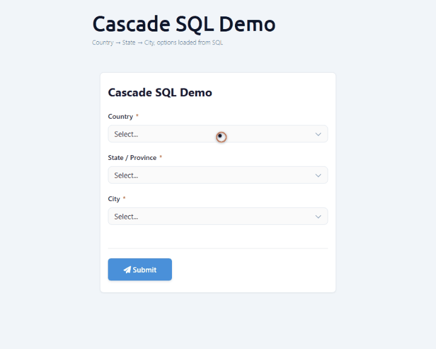

# Cascade-SQL Dropdowns (DNN)

Build dependent dropdowns whose options come from a SQL table, where selecting a
value in the **parent** dropdown filters the **child** dropdown — for example
**Country → State → City**.

Everything below was built and **live-verified** on a DNN 10.3 site
(`DNN10322_MegaQA110`) against three real demo tables.

## The data

Three tables in the site database (`DashboardDatabase`):

```sql
CREATE TABLE dbo.MFDemo_Country (Id INT PRIMARY KEY, Name NVARCHAR(80));
CREATE TABLE dbo.MFDemo_State   (Id INT PRIMARY KEY, CountryId INT, Name NVARCHAR(80));
CREATE TABLE dbo.MFDemo_City    (Id INT PRIMARY KEY, StateId INT,  Name NVARCHAR(80));
-- e.g. Vietnam(1) → Ha Noi(11) → Hoan Kiem(101), Cau Giay(102) …
```

## The three fields

A cascading SQL dropdown is a normal `Select` field whose **`properties`** bag
carries the SQL config. The child names its parent in `optionsDependsOn`, and the
parent's value is bound into the child's SQL via a `:token` **whose name equals the
parent field key**.

```json
{
  "key": "country", "type": "Select", "label": "Country", "required": true,
  "options": [{ "value": "", "label": "-- select country --" }],
  "properties": {
    "optionsSource": "sql",
    "optionsConnectionKey": "DashboardDatabase",
    "optionsSql": "SELECT Id, Name FROM dbo.MFDemo_Country ORDER BY Name"
  }
}
```
```json
{
  "key": "state", "type": "Select", "label": "State / Province", "required": true,
  "options": [{ "value": "", "label": "-- pick a country first --" }],
  "properties": {
    "optionsSource": "sql",
    "optionsConnectionKey": "DashboardDatabase",
    "optionsSql": "SELECT Id, Name FROM dbo.MFDemo_State WHERE CountryId = :country ORDER BY Name",
    "optionsDependsOn": ["country"],
    "optionsReloadOnChange": true
  }
}
```
```json
{
  "key": "city", "type": "Select", "label": "City", "required": true,
  "options": [{ "value": "", "label": "-- pick a state first --" }],
  "properties": {
    "optionsSource": "sql",
    "optionsConnectionKey": "DashboardDatabase",
    "optionsSql": "SELECT Id, Name FROM dbo.MFDemo_City WHERE StateId = :state ORDER BY Name",
    "optionsDependsOn": ["state"],
    "optionsReloadOnChange": true
  }
}
```

The first column of each `SELECT` is the option **value**, the second is the **label**.

## How it wires together

- Each dropdown with `optionsSource:"sql"` is loaded from
  `GET /DesktopModules/MegaForm/API/Submit/FieldOptions?formId={N}&fieldKey={key}`
  (anonymous — the public renderer calls it).
- When a **parent** changes, the renderer re-fetches the child and appends the
  parent's value as `&__p__<parentKey>=<value>`. The server strips `__p__`, binds
  it as the SQL parameter `@<parentKey>`, and runs the child's `optionsSql`.
- So `:country` in the state SQL is filled by `&__p__country=…`, and `:state` in
  the city SQL by `&__p__state=…`.

## Verified live

Hitting the endpoint directly on the DNN site (form #34) proves the filtering:

```
GET …/Submit/FieldOptions?formId=34&fieldKey=country
→ [{"Value":"3","Label":"Japan"},{"Value":"2","Label":"United States"},{"Value":"1","Label":"Vietnam"}]

GET …/Submit/FieldOptions?formId=34&fieldKey=state&__p__country=1     (Vietnam)
→ [{"Value":"13","Label":"Da Nang"},{"Value":"11","Label":"Ha Noi"},{"Value":"12","Label":"Ho Chi Minh"}]

GET …/Submit/FieldOptions?formId=34&fieldKey=state&__p__country=2     (United States)
→ [{"Value":"21","Label":"California"},{"Value":"23","Label":"New York"},{"Value":"22","Label":"Texas"}]

GET …/Submit/FieldOptions?formId=34&fieldKey=city&__p__state=21       (California)
→ [{"Value":"201","Label":"Los Angeles"},{"Value":"202","Label":"San Francisco"}]

GET …/Submit/FieldOptions?formId=34&fieldKey=state                    (no parent)
→ []
```



## ⭐ Gotchas (each caused a real silent failure)

- **The `:token` name must equal the `optionsDependsOn` key.** `optionsDependsOn:["country"]`
  → the SQL must reference `:country`. A mismatch binds the parameter to `NULL` and the
  child returns an **empty list, silently** — no error.
- **Missing `optionsSource:"sql"`** (or a missing `optionsConnectionKey`) also returns an
  empty list silently. Set both.
- Before a parent is chosen, the child's `:token` binds to `NULL`, so the child is empty
  by design (`state` with no `country` returns `[]` above) — that is correct, not a bug.
- `optionsConnectionKey` empty falls back to `DashboardDatabase` (the site DB). To read
  another database, register it first (Database Settings) and use its key.
- Inline `optionsSql` is **SELECT-only** — DML / `;` / comments are rejected. Results are
  capped at 500 rows; for large child sets pair the dropdown with a typeahead so the cap
  doesn't drop rows.

## Stored-procedure variant

Set `"optionsType":"storedproc"` and make `optionsSql` the procedure name; the parent
values are passed as `@`-prefixed proc parameters (same `optionsDependsOn`).

## Prerequisites

- DNN 10.x, MegaForm installed, Host/Administrator access.
- Parent→child tables on `DashboardDatabase` (or a registered named connection).
