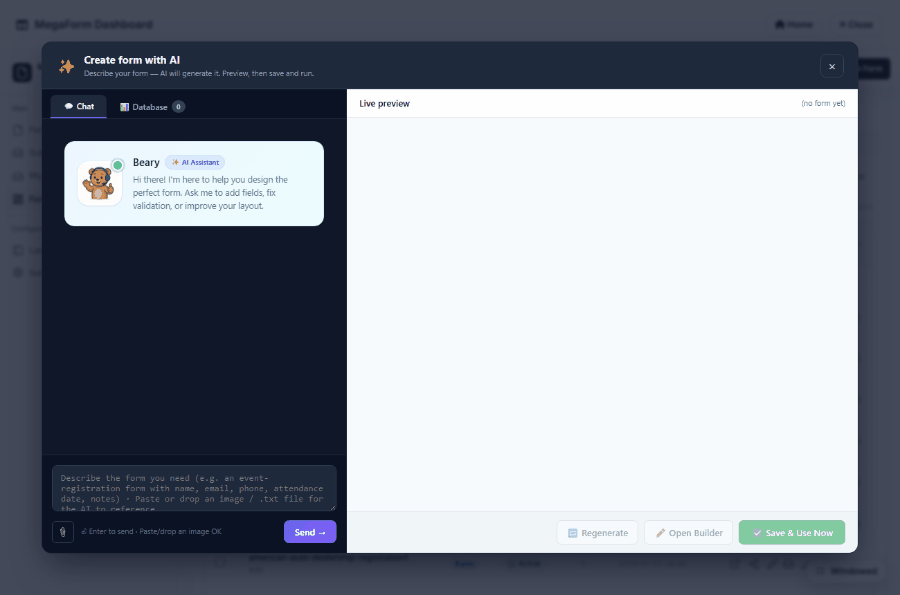

# Create a Form with AI (DNN)

Instead of dragging fields one by one, you can **describe** the form you want and let MegaForm's
assistant build it for you — right from the Dashboard, with a live preview you can save and run.

## The flow

1. Open the **Form Dashboard** and click **✨ Create with AI**.
2. The **Create form with AI** window opens — a chat on the left (the *Beary* assistant) and a
   **Live preview** on the right.
3. **Describe the form** in plain language, for example:
   > *Premium event registration: name, email, ticket type as choice cards (Standard, VIP,
   > Backstage), dietary preference as chips, and number of guests.*
4. Press **Send** (or Enter). The assistant generates the schema and renders it in the **Live
   preview** as you watch.
5. Refine by chatting further ("add a phone field", "make ticket type required", "use a two-column
   layout"), click **🔄 Regenerate** to try again, or **✏️ Open Builder** to fine-tune by hand.
6. Click **✅ Save & Use Now** to persist the form and start collecting submissions.

## What the assistant produces

The generated form is a normal MegaForm — so it can use the full widget set, not just plain inputs:
**choice cards**, **chips**, dropdowns, date pickers, file uploads, multi-step layouts and a theme.
Ask for those explicitly ("ticket type as **choice cards**", "dietary preference as **chips**") and
they appear in the preview as premium controls, ready to theme in the [Form Builder](dnn-form-builder.md).

## You can also bind it to a table

Switch to the **Database** tab inside the assistant to point the new form at one of your SQL tables
(same allow-listed connections as the builder's [DB tab](dnn-sql-table.md)) — the AI maps the form's
fields to the table's columns so each submission writes a row.

## Requirements

- **AI Settings must have an API key.** Configure your provider once under
  [Configuring the AI Assistant](dnn-ai-configuration.md) — without a key the assistant replies
  *"No API key configured. Open AI Settings."* and cannot generate.
- Host/Administrator access to the Dashboard.

> For writing effective prompts (field types, layouts, validation, themes), see
> [AI Prompts for Form Design](dnn-ai-prompts.md). To edit an existing form by chatting instead of
> creating a new one, use the in-builder [AI Form Designer](dnn-ai-form-designer.md).
