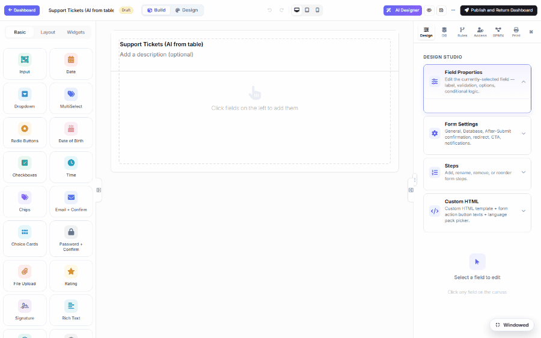
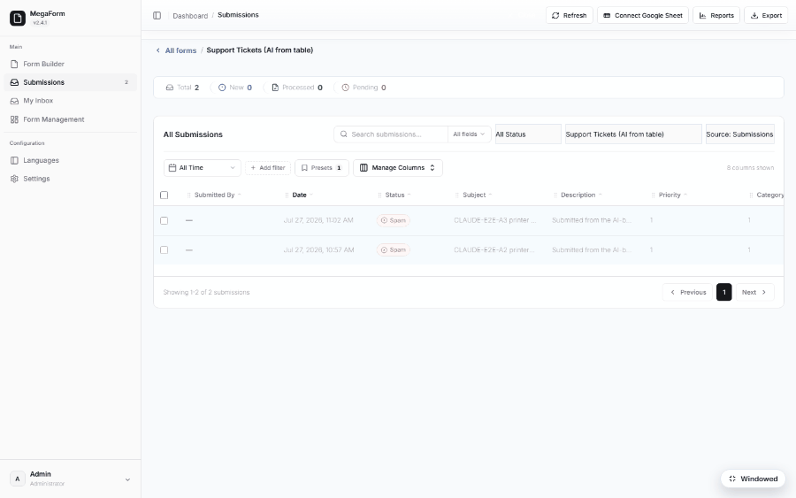
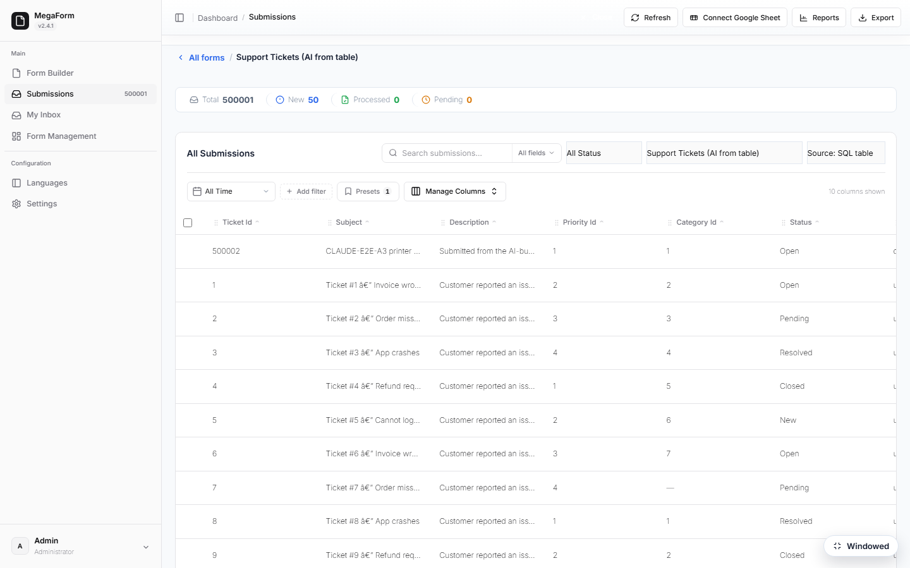

# AI Forms from a SQL Table (DNN)

Point the AI Designer at a table that already exists — including one in a
[second database](dnn-database-connections.md) — and it writes the whole form for you: a field per
column, foreign keys turned into dropdowns that read the lookup tables, and the insert statement
wired up. Then switch the Submissions grid to the table and **every historical row is already
there** — no import, no migration.

## 1. Give the assistant the table

1. Open a form in the **Builder** and click **AI Designer**.
2. Switch to the **Database** tab.
3. Choose the connection (the demo uses `CustomerErp`, pointing at a legacy ERP database).
4. Search for the table and tick it — the tab badge counts the tables the assistant may use.
5. Back on **Chat**, describe the form. Naming the lookup tables is what turns foreign-key columns
   into real dropdowns:

   > Build a data-entry form for the `dbo.SupportTickets` table: Subject, Description, Priority,
   > Category, Status, Customer Email, Phone and Total Cost. Use the `Priorities` and `Categories`
   > lookup tables for the Priority and Category dropdowns, and wire the form to insert into
   > `SupportTickets`.

The assistant reads the real column names and types, so `PriorityId` becomes a Select whose options
come from `SELECT Id AS value, Name AS label FROM Priorities` **on the same connection**, `TotalCost`
becomes a number, `CustomerEmail` an email field, and the form's *Database insert* setting gets an
`INSERT INTO [dbo].[SupportTickets] (...) VALUES (:subject, :description, :priority_id, …)`.

> A warning like *"SQL references table(s) not found on the database"* refers to the site database:
> the validator checks names there first. If the generated SQL carries your chosen connection key,
> the form works — publish and try it.

## 2. Check it before you publish

- **Fields** — one per column you asked for; drop the ones users should not fill.
- **Dropdowns** — open the form; the lookup options must actually appear.
- **Database insert** (Settings → Database) — the connection key must be your named connection,
  and every non-nullable column needs a field feeding it.
- Remember `db_datawriter` for the app pool identity, or the insert fails silently.

Publish, submit once, and confirm the row lands in the table.

## 3. Past rows appear in Submissions

Open **Submissions** for the form and use the source selector in the toolbar:

- **Source: Submissions** — what MegaForm itself has collected (empty for a brand-new form).
- **Source: SQL table** — the live contents of the bound table.

Switching sources keeps your filters and paging. Search, sort, paging and the row count are all
pushed into SQL, so a table with half a million rows opens as fast as an empty one — the demo table
holds 500,000 tickets.

New submissions are written into that same table, so the form and the legacy application stay on
one set of records.

## Good to know

- The assistant can only see tables you tick — that is the boundary of what it may query.
- A table needs a primary key for row-level actions (open, edit) to address a record.
- Column names in generated SQL come from the table itself, not from the field keys: field
  `customer_email` maps to column `CustomerEmail`.
- Parameter names may not contain dots; composite fields (e.g. a phone with parts) are bound as one
  value.
