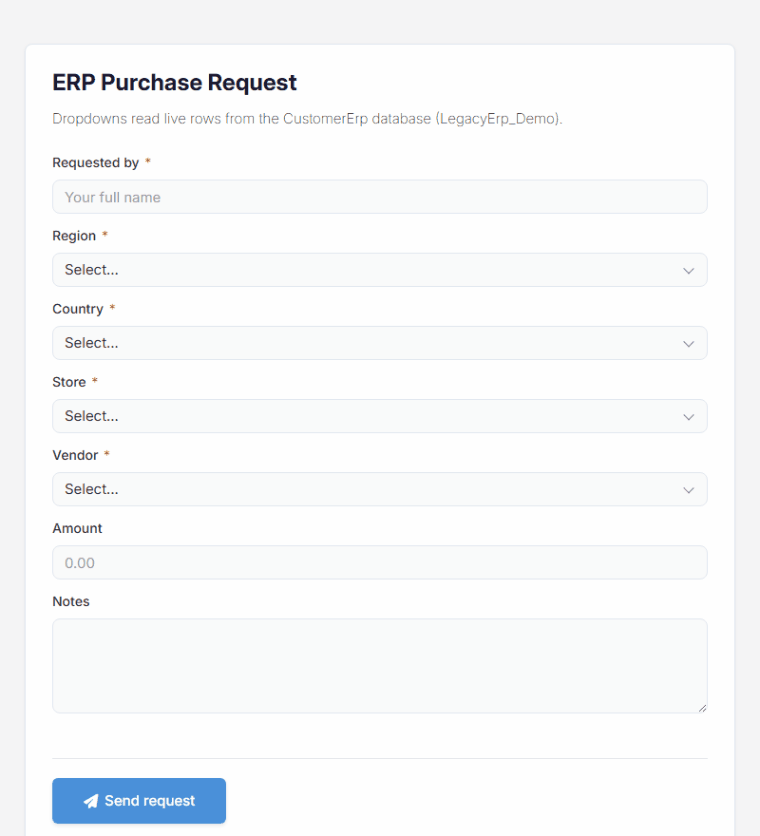
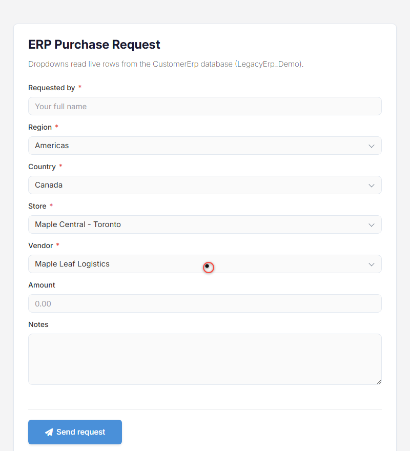

# Connect a Second SQL Database (DNN)

Out of the box MegaForm reads and writes the DNN site database — the connection it calls
**`DashboardDatabase`**. Most real projects also have a *second* database: the ERP, the CRM, the
legacy line-of-business system. MegaForm can talk to it directly: add the connection once in
**Database Settings**, and every dropdown, DataGrid, AI tool and "insert into a table" action can
pick it by name. Nothing is copied — the form reads live rows.

## Add the connection

1. Open the MegaForm **Dashboard → Settings → Database Settings**.
2. The card at the top is the site's own database. Under **Saved connections** click
   **Add connection** and fill in:
   - **Name** — an identifier you will pick from dropdowns later, e.g. `CustomerErp`.
     Letters, digits, `-` and `_`; it may not shadow a reserved name (`DashboardDatabase`,
     `DefaultConnection`, `SiteSqlServer`, `DnnDefault`, `MegaForm`).
   - **Provider** — SQL Server, MySQL, PostgreSQL or SQLite.
   - **Connection string** — for example
     `Data Source=SQLSERVER;Initial Catalog=LegacyErp_Demo;Integrated Security=True;TrustServerCertificate=True`
3. Press **Test connection** — MegaForm opens the connection server-side and reports the database
   name and server version.
4. **Save**. The name now appears everywhere a connection can be chosen.

> Connection strings live server-side only. The list echoes them with `password=***` masked, and
> saving the masked value back keeps the stored secret — so you can fix a typo in the server name
> without retyping the password.

## Grant the app pool access

With `Integrated Security=True`, SQL Server authenticates as the **DNN application pool identity**,
not as the administrator who is logged in. On the target database run:

```sql
CREATE USER [IIS AppPool\YourDnnPool] FOR LOGIN [IIS AppPool\YourDnnPool];
ALTER ROLE db_datareader ADD MEMBER [IIS AppPool\YourDnnPool];   -- dropdowns, grids, AI browsing
ALTER ROLE db_datawriter ADD MEMBER [IIS AppPool\YourDnnPool];   -- only if forms insert rows
```

Read-only access is enough to *fill* dropdowns. A form that writes into the external table needs
`db_datawriter` as well — without it the insert fails and the submission is stored with no row
written.

## Use it: cascading dropdowns over ERP data

Once the connection exists, any Select/Radio/Checkbox field can be sourced from it. Set
**Options source = SQL**, choose the connection, and write a query that returns `value` and `label`
columns. A child dropdown adds **Depends on** and takes the parent's value as a `:parameter`:

| Field     | Connection    | SQL |
|-----------|---------------|-----|
| `region`  | `CustomerErp` | `SELECT DISTINCT Region AS value, Region AS label FROM dbo.Country ORDER BY Region` |
| `country` | `CustomerErp` | `SELECT CountryCode AS value, CountryName AS label FROM dbo.Country WHERE Region = :region ORDER BY CountryName` |
| `store`   | `CustomerErp` | `SELECT StoreId AS value, StoreName + ' - ' + City AS label FROM dbo.Stores WHERE CountryCode = :country ORDER BY StoreName` |
| `vendor`  | `CustomerErp` | `SELECT VendorId AS value, VendorName AS label FROM dbo.Vendors WHERE CountryCode = :country ORDER BY VendorName` |

Every parameter is bound — never string-concatenated — and the result set is capped server-side, so
a mistyped query cannot drag a million rows into a public form.



The chain re-filters as you go: pick *Europe → Germany* and only the two German stores and vendors
remain; switch to *Americas → Canada* and the same fields reload from the ERP.



## Where else the connection shows up

- **Builder → DB tab** — browse the second database's tables and drop columns onto the canvas.
- **AI Designer → Database tab** — pick the connection, tick a table, and let the assistant build a
  form for it (see [AI Forms from a SQL Table](dnn-ai-sql-table-form.md)).
- **Form settings → Database insert** — write submissions into a table on that connection.
- **DataGrid / Subform widgets** — list and edit rows that live in the other database.

## Troubleshooting

| Symptom | Cause |
|---|---|
| The connection list is empty after adding a row directly in SQL | Portal settings are cached — always save through Database Settings, which flushes the cache. |
| "could not list tables" on the site's own database | The stored `DashboardDatabase` string points at another server/database (common after cloning a site). Re-save it in Database Settings. |
| Dropdown is empty at runtime | The query must alias its columns `value` and `label`, and the app pool identity needs `db_datareader`. |
| Submission succeeds but no row appears in the table | The insert needs `db_datawriter` on the target database. |
