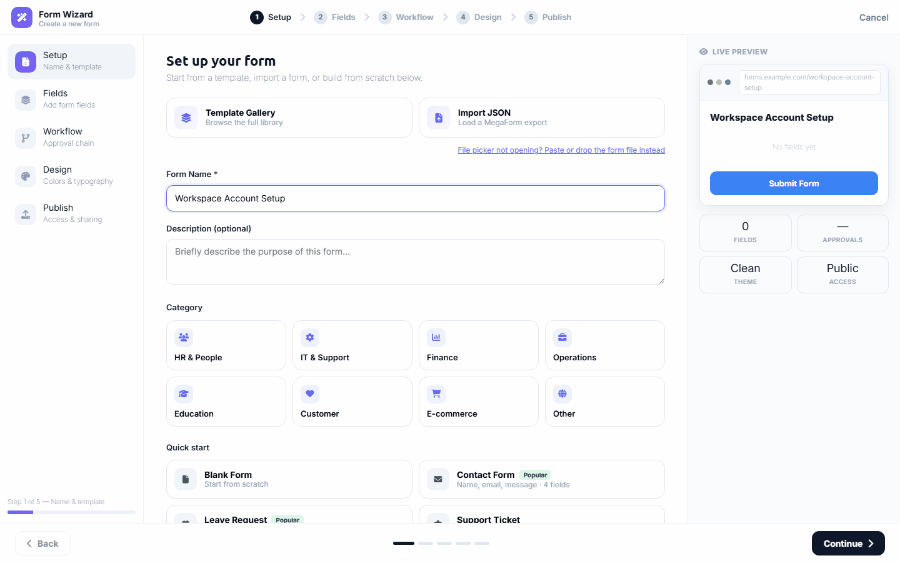
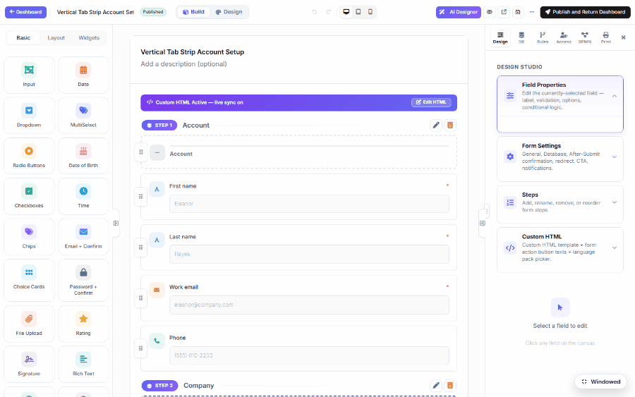
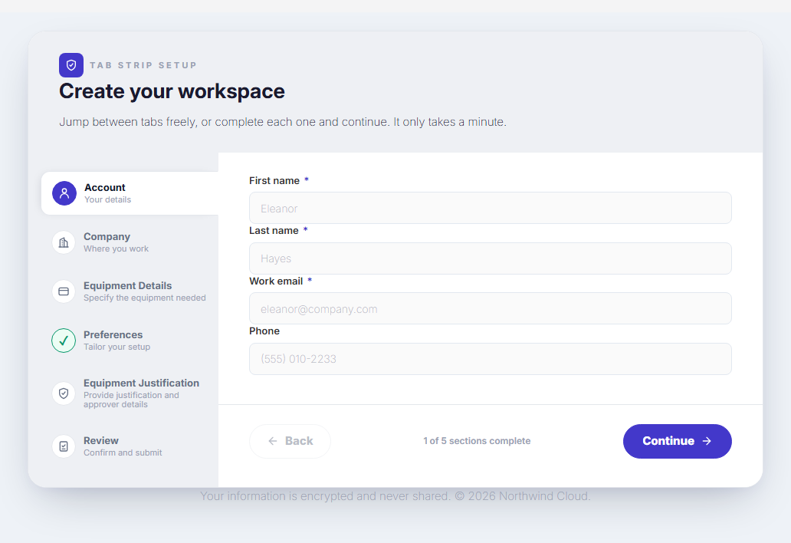

# Download a Design, Remix it with AI (DNN)

The fastest way to a finished form is to start from a design somebody already made. Your purchased
module can download **dozens of premium designs from the online gallery at no extra cost**, and the
AI Designer can then turn any of them into the form you actually need — keeping the design.

## 1. Install a design from the online gallery

1. **Dashboard → New Form**, give the form a name.
2. Open **Template Gallery** and switch from *Installed* to **Online gallery**. The counter on the
   right shows how many designs are available to install.
3. Search or filter by category, then click a card. MegaForm downloads it **server-side**, verifies
   the file against the sha256 published in the catalog, unpacks its artwork into your portal, and
   marks the card *Installed*.
4. Step through the wizard and press **Create Form**.

> Trial installs may browse and preview the whole catalog; installing is a licensed action. Nothing
> leaves your server unverified — the browser never talks to the gallery host directly.

## 2. Remix it with the AI Designer

The downloaded design brings its own shell (hero, step rail, cards). Open the form in the
**Builder → AI Designer** and describe the form you want instead. Ask it to keep the design:

> Turn this account setup into an IT equipment request form. Replace the billing and security
> fields with: Asset type (dropdown: Laptop, Monitor, Phone, Docking station), Quantity, Needed by
> date, Business justification, and Approver email. Keep the existing design and steps.

The assistant edits **fields**, not the shell: the tab-strip layout, colours and step chrome are
untouched, while the fields — and the step titles that describe them — become yours.

## 3. View the working form

Publish, and the form runs with the same design it was downloaded with:

## Tips

- **Name the fields you want.** "Add equipment fields" gives you a guess; listing the fields and
  their types gives you the form.
- **Say "keep the existing design and steps"** when you remix a premium template — that instruction
  is what keeps the assistant on the shell's rails.
- **Re-run the prompt** to refine. Each message is applied live to the canvas; *Save* is what
  persists it.
- Designs you install stay in your portal's template list, so the next form can start from the same
  design without downloading again.
