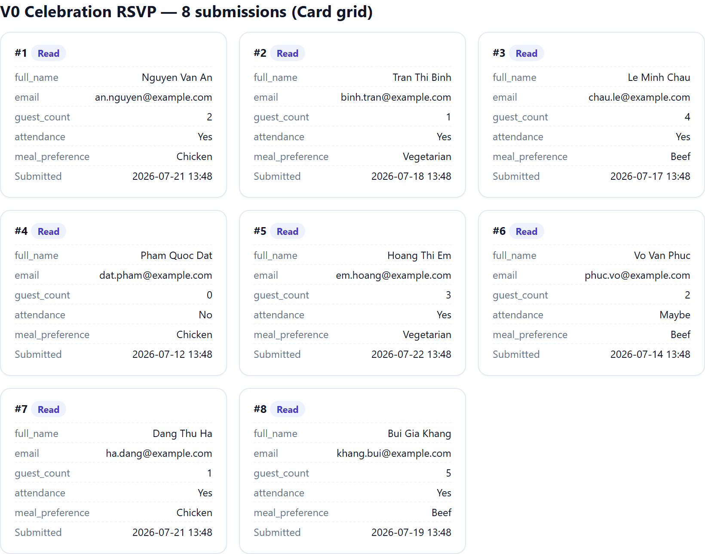
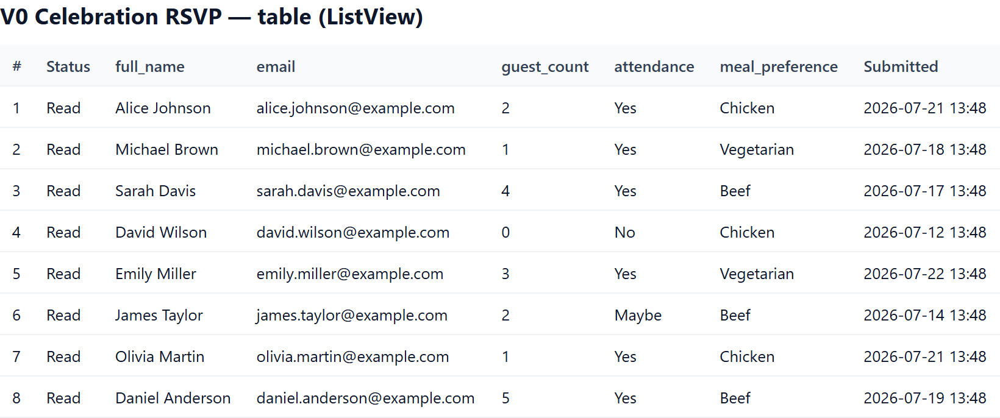
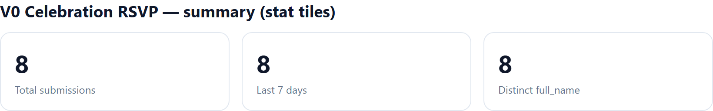

# Display Submissions with Razor (DNN)

Read form-submission data with the MegaForm SDK and render it in **your own** Razor
views — a **Card grid**, a **ListView / table**, and a **stat-tile summary** — all
from the same submission query. Every snippet below is a complete DNN **Razor Host**
script you can paste and run.

> These build on the SDK read path documented in [DNN Razor Host](../programming/dnn-razor-host.md)
> and [Reading Data](../programming/reading-data.md). The `IMegaFormClient` read surface was
> live-verified on a DNN 10 site (form **#1267**, 204 submissions).

## The shared helper

Razor Host pages are synchronous while the SDK is async, so both samples wrap calls
in the same `Run<T>` helper. Paste this block at the top of each script:

```csharp
@using System.Linq
@using Newtonsoft.Json.Linq
@using MegaForm.Sdk
@using MegaForm.Sdk.Abstractions
@functions {
    static T Run<T>(System.Func<IMegaFormClient, System.Threading.Tasks.Task<T>> action)
    {
        // Touch the locator once so the ambient SDK accessor is wired.
        var _ = MegaForm.DNN.Services.DnnServiceLocator.Instance;
        return System.Threading.Tasks.Task.Run(() => MegaFormSdk.RunAsync(action))
                     .GetAwaiter().GetResult();
    }
}
@{
    var scope  = new MegaFormScope { PortalId = Dnn.Portal.PortalId };
    int formId = 0; int.TryParse(Request.QueryString["formId"], out formId);

    // Pick the requested form, or the first one in the portal.
    var forms = Run(c => c.Forms.ListFormsAsync(new FormQuery { PageSize = 100 }, scope)).Items.ToList();
    var form  = forms.FirstOrDefault(f => f.FormId == formId) ?? forms.FirstOrDefault();
    formId = form != null ? form.FormId : 0;

    // Load this form's submissions once — all three layouts reuse `rows`.
    var page = Run(c => c.Submissions.FindAsync(
        new SubmissionQuery { FormId = formId, PageSize = 200 }, scope));
    var rows = page.Items.ToList();

    // DataJson is per-field JSON on DNN. Parse once into a dictionary per row.
    System.Func<string, JObject> parse = j => {
        try { return string.IsNullOrWhiteSpace(j) ? new JObject() : JObject.Parse(j); }
        catch { return new JObject(); }
    };
    var data = rows.ToDictionary(r => r.SubmissionId, r => parse(r.DataJson));

    // Discover up to 6 data columns from the first few rows (schema-free).
    var columns = data.Values
        .SelectMany(o => o.Properties().Select(p => p.Name))
        .Where(n => !n.StartsWith("__"))
        .Distinct().Take(6).ToList();
    System.Func<int,string,string> cell = (id,col) => {
        JToken t; return data[id].TryGetValue(col, out t) ? t.ToString() : "";
    };
}
```

Everything after this block is layout — pick one, or stack all three on the page.

## Layout 1 — Card grid

```html
<style>
  .mfg { display:grid; grid-template-columns:repeat(auto-fill,minmax(240px,1fr)); gap:14px; }
  .mfg .card { border:1px solid #e2e8f0; border-radius:12px; padding:14px 16px; background:#fff;
               box-shadow:0 1px 2px rgba(0,0,0,.04); }
  .mfg .card h4 { margin:0 0 8px; font-size:13px; color:#0f172a; }
  .mfg .card .kv { display:flex; justify-content:space-between; gap:10px; font-size:12px;
                   padding:3px 0; border-top:1px dashed #f1f5f9; }
  .mfg .card .kv span:first-child { color:#64748b; }
  .mfg .badge { font-size:11px; padding:2px 8px; border-radius:999px; background:#eef2ff; color:#4338ca; }
</style>
<h3>@(form?.Title) — @rows.Count submissions</h3>
<div class="mfg">
@foreach (var r in rows) {
  <div class="card">
    <h4>#@r.SubmissionId <span class="badge">@r.Status</span></h4>
    @foreach (var col in columns) {
      <div class="kv"><span>@col</span><span>@cell(r.SubmissionId, col)</span></div>
    }
    <div class="kv"><span>Submitted</span><span>@r.CreatedOnUtc.ToString("yyyy-MM-dd HH:mm")</span></div>
  </div>
}
</div>
```

**Rendered output** (real submissions from the QA site's RSVP form):



## Layout 2 — ListView / table

```html
<style>
  table.mft { width:100%; border-collapse:collapse; font-size:13px; }
  table.mft th, table.mft td { padding:8px 10px; border-bottom:1px solid #eef2f7; text-align:left; }
  table.mft th { background:#f8fafc; color:#334155; font-weight:600; position:sticky; top:0; }
  table.mft tr:hover td { background:#f8fafc; }
</style>
<h3>@(form?.Title) — table</h3>
<table class="mft">
  <thead>
    <tr><th>#</th><th>Status</th>@foreach (var col in columns) { <th>@col</th> }<th>Submitted</th></tr>
  </thead>
  <tbody>
  @foreach (var r in rows) {
    <tr>
      <td>@r.SubmissionId</td>
      <td>@r.Status</td>
      @foreach (var col in columns) { <td>@cell(r.SubmissionId, col)</td> }
      <td>@r.CreatedOnUtc.ToString("yyyy-MM-dd HH:mm")</td>
    </tr>
  }
  </tbody>
</table>
```

**Rendered output:**



## Layout 3 — Stat tiles (summary)

Aggregate the same `rows` — no extra query. This example counts totals, distinct
values of the first column, and submissions in the last 7 days.

```html
<style>
  .mfs { display:flex; gap:14px; flex-wrap:wrap; }
  .mfs .tile { flex:1; min-width:150px; border:1px solid #e2e8f0; border-radius:12px; padding:16px; background:#fff; }
  .mfs .tile .n { font-size:28px; font-weight:700; color:#0f172a; }
  .mfs .tile .l { font-size:12px; color:#64748b; margin-top:4px; }
</style>
@{
    var last7 = rows.Count(r => r.CreatedOnUtc >= System.DateTime.UtcNow.AddDays(-7));
    var firstCol = columns.FirstOrDefault();
    var distinct = firstCol == null ? 0 :
        rows.Select(r => cell(r.SubmissionId, firstCol)).Distinct().Count();
}
<div class="mfs">
  <div class="tile"><div class="n">@rows.Count</div><div class="l">Total submissions</div></div>
  <div class="tile"><div class="n">@last7</div><div class="l">Last 7 days</div></div>
  <div class="tile"><div class="n">@distinct</div><div class="l">Distinct @firstCol</div></div>
</div>
```

**Rendered output:**



> The screenshots above show the exact markup emitted by the Razor above, populated with
> real submissions from the QA site (the RSVP form's `full_name`, `email`, `guest_count`,
> `attendance`, `meal_preference` fields discovered dynamically).

## Run it

1. Add a **Razor Host** module to a page, **Edit Script**, paste the shared helper +
   one (or all) of the layouts into a new `.cshtml`.
2. Browse `<razor-host-page>?formId=1267` (any form id that has submissions).
3. The required DLLs (`MegaForm.Sdk.dll`, `MegaForm.Core.dll`, `MegaForm.DNN.dll`) already
   ship in the site `bin` — no extra deployment.

> **Reading model note:** DNN keeps the per-field `DataJson`
> (`DnnSubmissionDataStore.SupportsDataJsonCollapse = false`), so `r.DataJson` returns each
> submission's fields directly — the layouts above parse it with `JObject` and discover columns
> dynamically, so they work for any form without hard-coding field names.
