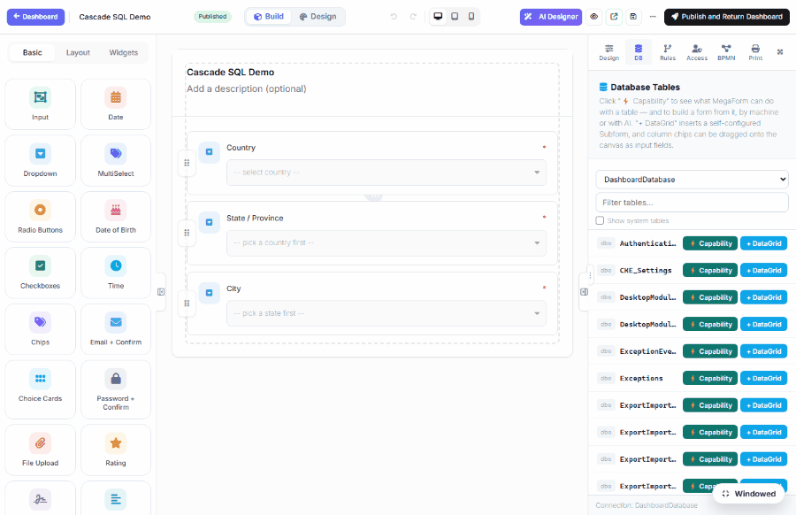

# Read & Write a SQL Table Directly (DNN)

MegaForm can point at an existing SQL Server table in your DNN database and turn it into a form:
**browse the table in the builder's DB tab, drop its columns onto the canvas as fields, submit,
and the row appears in the table** — no code, no manual field mapping.



## Build a form from a table

1. Open a form in the **Builder** and select the **DB** tab (right panel, next to
   FIELD / SETTINGS / HTML / AI …). It lists the base tables on the connection.
2. Find your table (the demo uses `MFDemo_Product`) and click **⚡ Capability** to see what
   MegaForm can do with it — its key, required (non-nullable) columns, and whether it can be
   written to.
3. Turn columns into fields — two ways:
   - **+ DataGrid** inserts a self-configured **Subform** (grid) bound to the whole table — good
     for editing many rows.
   - **Column chips** — expand the table and click (or drag) a column chip onto the canvas to add a
     single matching input (`Name` → text, `Price` → number, `InStock` → checkbox, dates → date
     pickers). **Identity primary keys are skipped** automatically, so `Id` is never asked of the user.
4. **Publish**, submit the form, and the new row lands in the table.

## Choosing the connection

The DB tab reads from the site database (`DashboardDatabase`) by default. If your admin has
registered additional named connections (Settings → Database Settings), pick one from the
connection selector to browse its tables instead. Use **Filter** to narrow a long table list, and
tick **Show system tables** to include platform tables.

## The demo table

```sql
CREATE TABLE dbo.MFDemo_Product (
  Id INT IDENTITY(1,1) PRIMARY KEY,   -- identity PK, skipped on insert
  Name NVARCHAR(120) NOT NULL, Category NVARCHAR(60) NULL, Price DECIMAL(10,2) NULL,
  InStock BIT NOT NULL DEFAULT 1, CreatedUtc DATETIME2 NOT NULL DEFAULT SYSUTCDATETIME()
);
```

## Writing back to the table

When the form is submitted, MegaForm builds an `INSERT` whose columns are the table's real
columns, each valued by its closest form field. So a submission of `Name = "Laptop Stand",
Category = "Office", Price = 42.00, InStock = ✓` writes a new row into `dbo.MFDemo_Product` — `Id`
and `CreatedUtc` fill themselves (identity + default).

> The column→field mapping is by name similarity; review the generated fields before publishing so
> every required (non-nullable) column has a field feeding it, or the insert will fail on a missing value.

## Safety

- The connection is **never trusted from the browser** — the DB tab's table and column reads are
  gated server-side against the admin allow-list (`DashboardDatabase` plus any registered
  connection). A connection the operator never registered can't be reached.
- Table/column names are validated; only schema metadata is read to list tables.

## Prerequisites

- DNN 10.x, MegaForm installed, Host/Administrator access.
- A writable table on `DashboardDatabase` (or a registered named connection).
