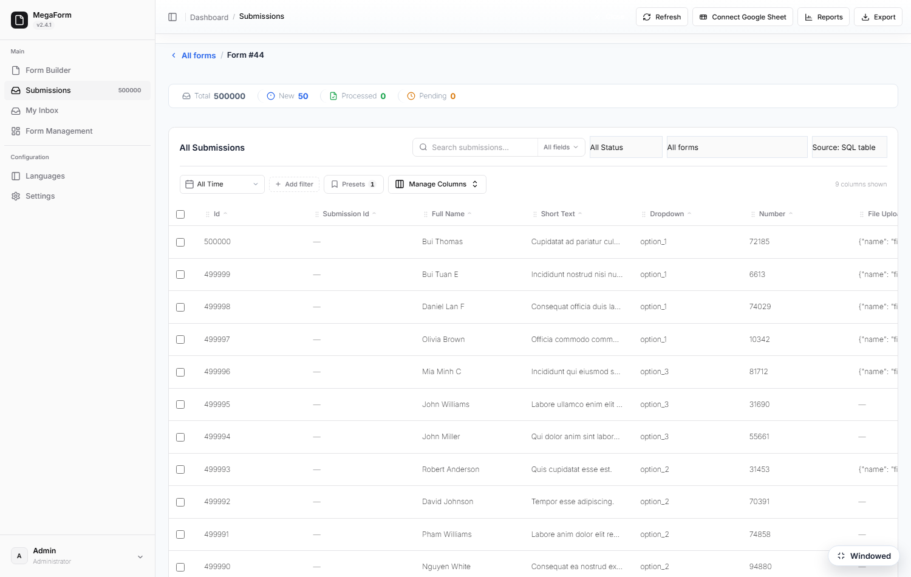
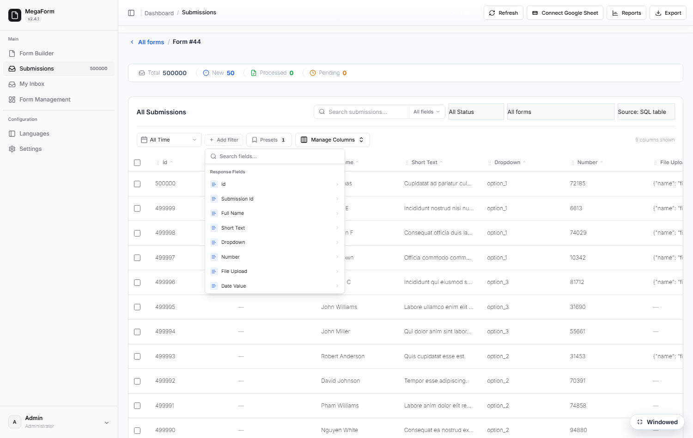
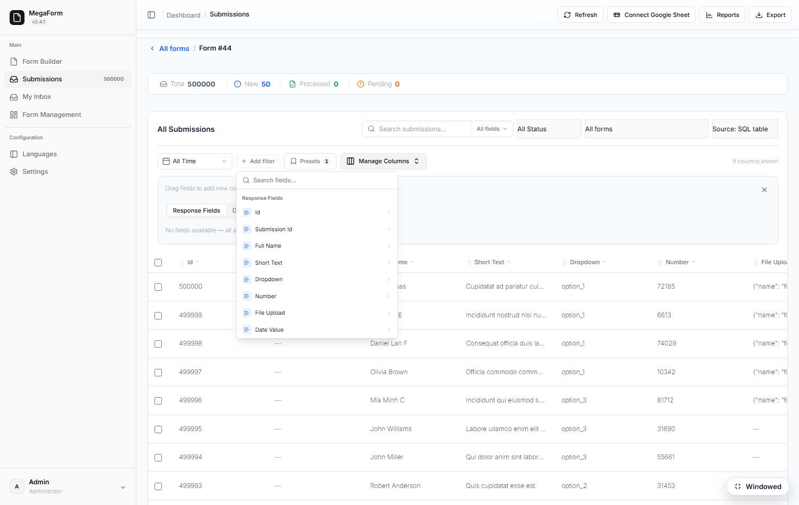
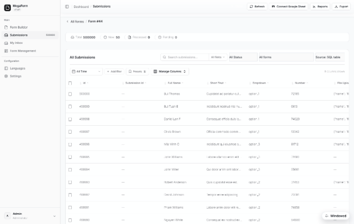
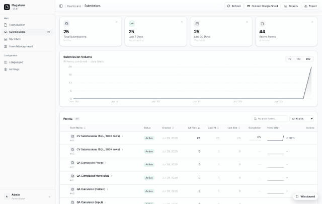

# Submissions grid — filters at scale (DNN)

A grid that only works on 30 rows isn't a grid. The submissions grid pushes paging, counts and
filters **into SQL**, so the page you see is the page the database computed — whatever the table
size. The screenshots below are a real DNN 10.3 install reading a **500,000-row** table.

## The toolbar

- **Search** — as-you-type, with a field-scope selector (*All fields*) to limit which field is
  searched.
- **Status** — New / Processed / Starred / Archived.
- **All Time** — date-range shortcut (from / to travel to SQL).
- **Add filter** — field conditions built from the form's own schema — every column of the bound
  source is offered, with the operators its type allows.
- **Presets** — save a filter combination under a name and recall it in one click.
- **Manage Columns** — choose and reorder the columns; widths drag; the layout is remembered per
  form.

## Reading a table you already have

The grid does not require the data to live in MegaForm's own tables. Point a **named SQL
connection** at the database you already run, bind a form to one of its tables, and the same grid
reads it live — nothing is imported or copied.

The **Source** picker in the toolbar flips between *Submissions* (MegaForm's own store) and
*SQL table* (the bound table). Measured on the install above, against a 500,000-row table on
SQL Server Express:

| Operation | Result |
| --- | --- |
| First page (25 rows) | 0.7 s |
| Subsequent pages | ~0.25 s |
| Exact total (`COUNT`) | 67 ms — the grid header shows `500000`, not "500+" |

## What the capability card decides

Before a table is bound, MegaForm probes it and freezes a **capability profile** — what the grid
may offer is derived from the table itself, never assumed:

- **Read-only account → read-only grid.** With a `db_datareader` login the profile reports
  `canInsert / canUpdate / canDelete = false` and says why ("The DB account is read-only"), so the
  UI never shows an action the database would refuse.
- **Search depends on the table.** Full-text index → full search; a small table → substring;
  otherwise prefix — and if no column qualifies, search is reported **off** and the grid steers you
  to field filters instead. That is honest behaviour, not a silent empty result: add a full-text
  index to the columns you want searched and re-probe to turn it on.
- **Sort, server-side filter, detail view and Export** stay available in all of those cases.
- **Very large tables** can require *filter before list*, so nobody opens a hundred-million-row
  table and waits for a scan.

## At scale

Paging, counts and filters are pushed into SQL with server-side caps — the grid never loads
"everything" into the browser or the server's memory. Bulk actions (status changes, delete,
Send-to-Inbox) operate on the current selection, and **Export** produces CSV of the current
filter — not just the visible page.

See also: [Submissions & My Inbox](dnn-submissions-inbox.md) ·
[Storage options](dnn-storage-options.md)
