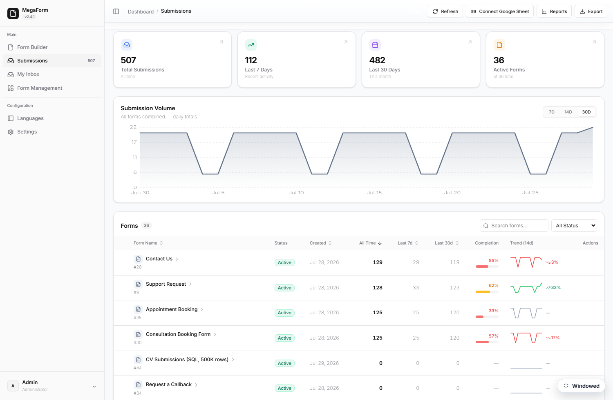
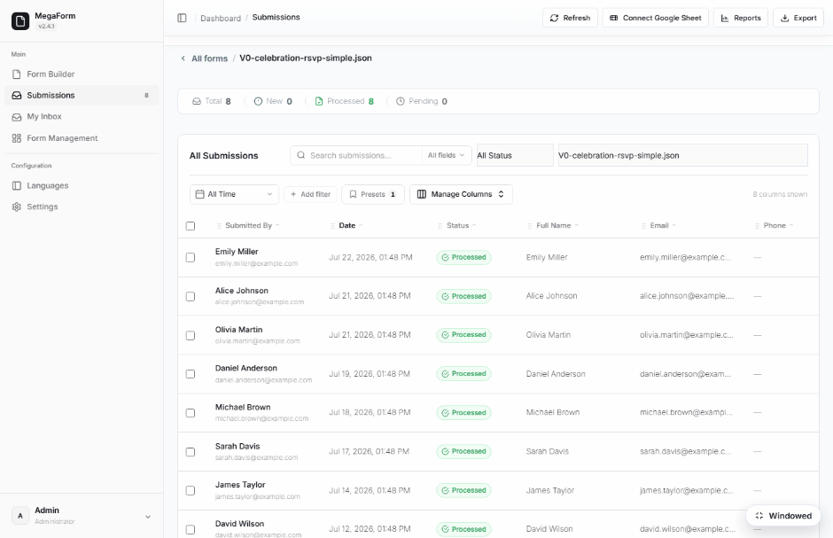
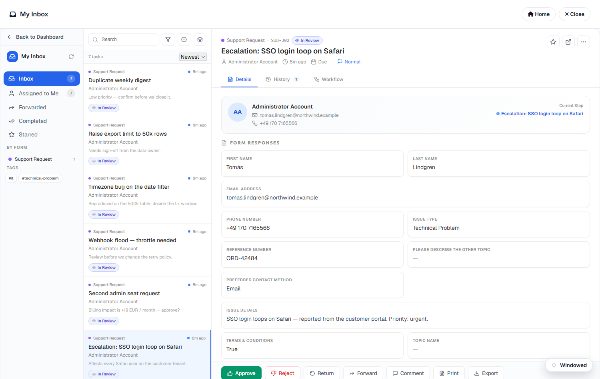
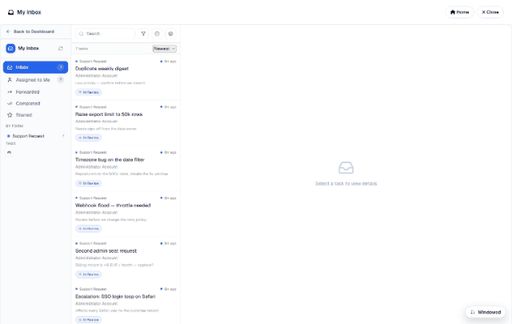

# Submissions & My Inbox (DNN)

Two surfaces handle everything that comes IN: **Submissions** (every record, admin view) and
**My Inbox** (each user's own workflow tasks). Both live in the Form Dashboard — and both can be
[a dedicated DNN page](dnn-module-setup.md).

## Submissions

The Submissions section opens on a per-form overview — KPIs plus a table of forms with counts,
completion and trends — and clicking a form drills into its **grid**: every submission as a row,
with the form's own fields as columns.

From the grid you can open any record's detail sheet (values, files, workflow history), change
status, print an A4 document of one submission, export CSV, connect a Google Sheet, or open
Reports. Filtering — and reading a table you already own — gets its own page:
[Submissions Grid — Filters at Scale](dnn-submissions-grid.md).

## My Inbox

My Inbox is the approver's view — only THEIR tasks. The left rail counts each state
(*Inbox, Assigned to Me, Forwarded, Completed, Starred*) and groups the queue **by form** and by
**tag**, so a reviewer working one process never has to read past another's:

Each card carries the form it came from, when it arrived, who it is assigned to, the note that
came with it and its current state chip (*In Review*).

### Opening a task

Selecting a card opens the task beside the queue: the requester, the submission's **Form
Responses** in full, and tabs for **Details / History / Workflow** — history is the audit trail of
who did what, workflow shows where the record sits in its approval chain.

The action bar is the whole reviewer vocabulary — **Approve · Reject · Return · Forward ·
Comment · Print · Export** — plus star and open-in-new-tab:

### How tasks get there

- **A workflow step** assigns them: an approval node routes the record to a user, a role or a
  department as the case advances — see [Approval Workflows & Inbox](dnn-workflow-approvals.md)
  and the [Workflow Library](dnn-workflow-library.md).
- **Send to Inbox** from the Submissions grid: an ad-hoc review task on any record, with a title
  and a note, even when the form has no workflow configured. That is how the seven tasks above
  were raised — real support tickets submitted through the public form, then routed to a reviewer.

Every task is resolved from the workflow tables on the server against the signed-in user; the
client is never trusted to say whose inbox it is.

## Who sees what

Submissions honor the form's **Access matrix** ([Field permissions](dnn-field-permissions.md)):
admins see everything; other roles need an explicit view/manage grant, and row-level rules
(own-records-only, approver-of-record) are enforced server-side. My Inbox is inherently
per-user — tasks are resolved from the workflow tables, never from the client.
