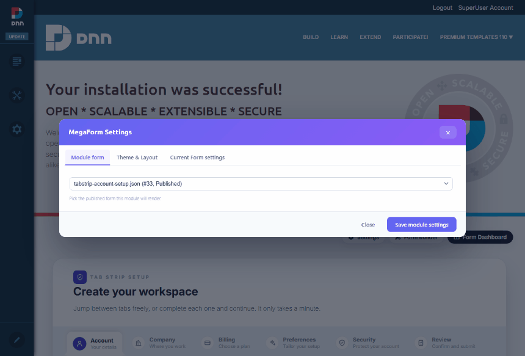

# Theme Compatibility (DNN)

MegaForm can either keep its own designed template styling or inherit the host page theme. This is
useful on DNN sites where the portal skin already defines a font and color scheme: premium forms can
stay brand-locked when you want a polished campaign page, or they can blend into the page so the DNN
skin controls the typography and color.

## Two styling modes

Use **MegaForm** as the source when the template should keep its original color palette,
typography, spacing, and custom shell. The form renders with the design it was authored with in the
builder, regardless of which DNN skin the page uses.

Use **From page** when the form should borrow the host page's font and colors. After switching
both **Typography source** and **Color source** to **From page**, the same module follows the DNN
skin's fonts and palette instead of the template's own styling.

## How to switch

1. Open the form page in DNN as an administrator and turn on **Edit** mode.
2. Click **Settings** on the MegaForm module's action menu.
3. Open **Theme & Layout**.
4. Under **Page integration**, choose the source for **Typography source** and **Color source**.
5. Click **Save module settings**.

The settings are module-aware: a form can keep MegaForm styling on one page and inherit the DNN
page skin on another page. The typography/color source flags are stored on the form, while the rest
of the Theme & Layout options (theme preset, max width, field spacing) stay per-module — so you can
mix a brand-locked landing page and a skin-blended internal page from the same published form.
