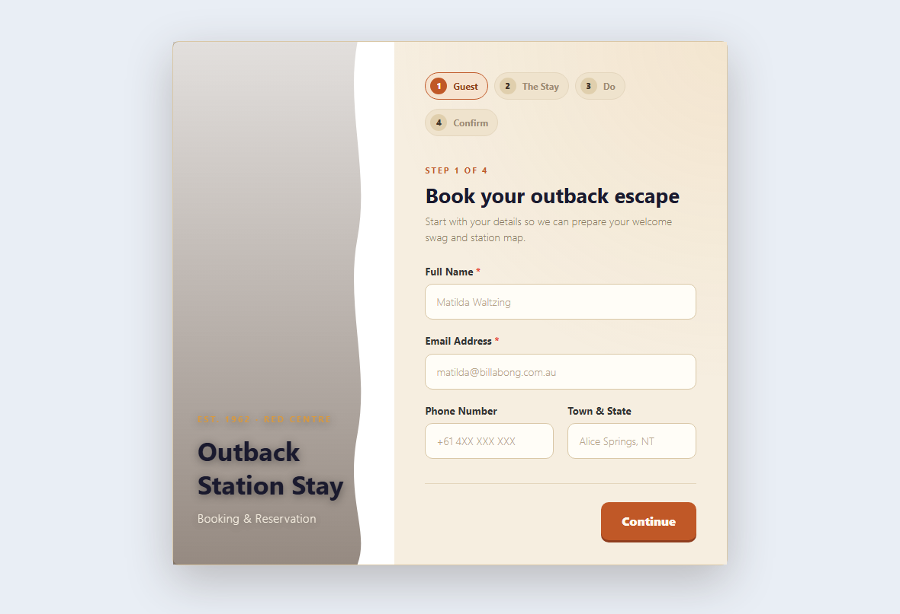
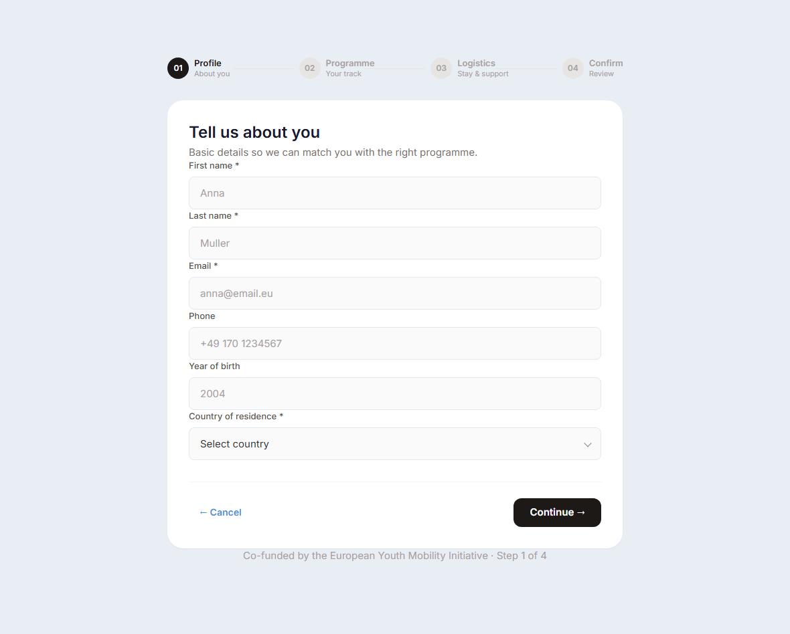
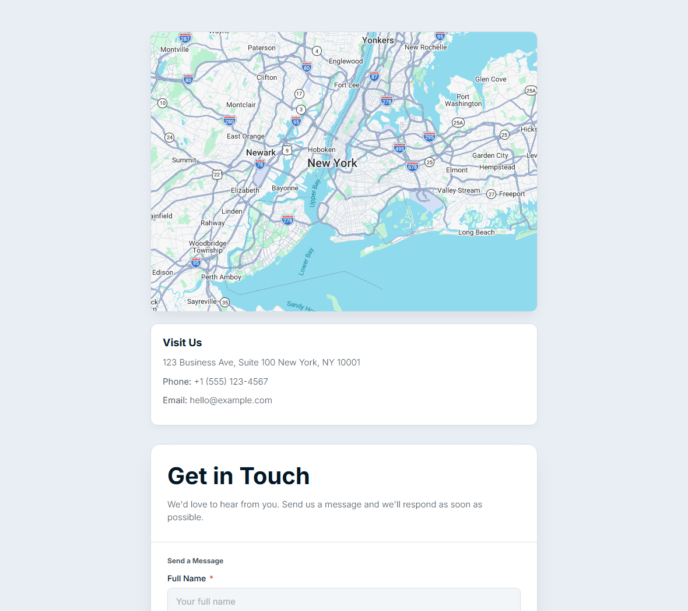
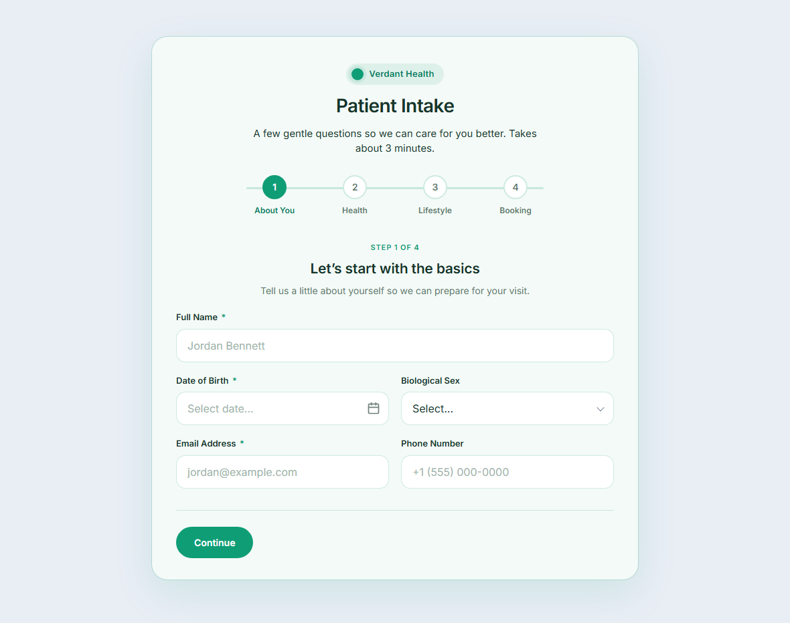
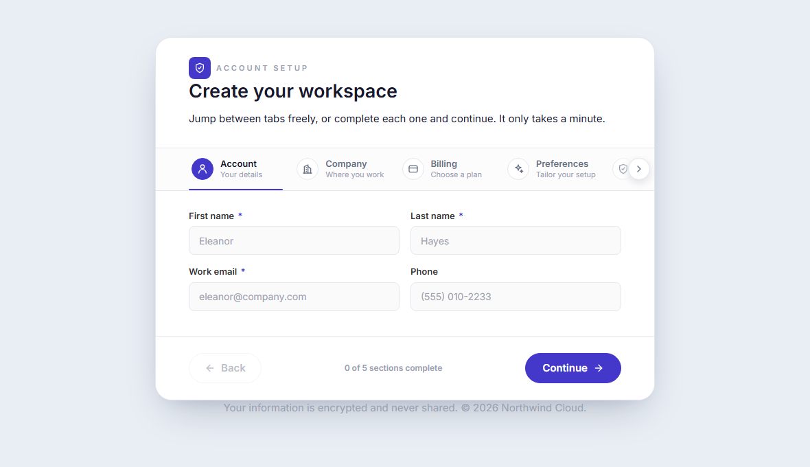
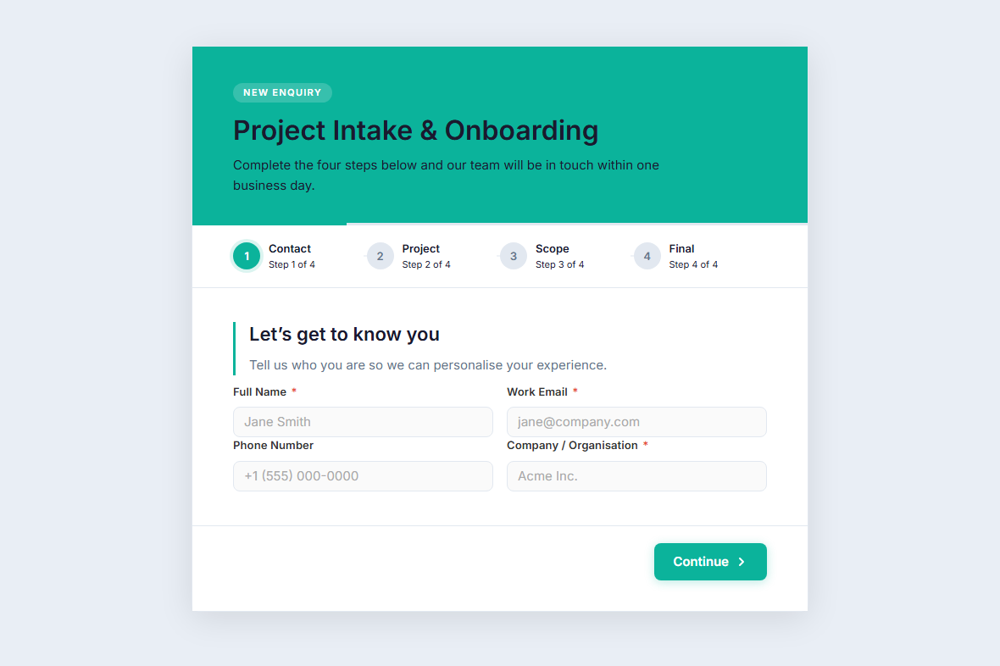
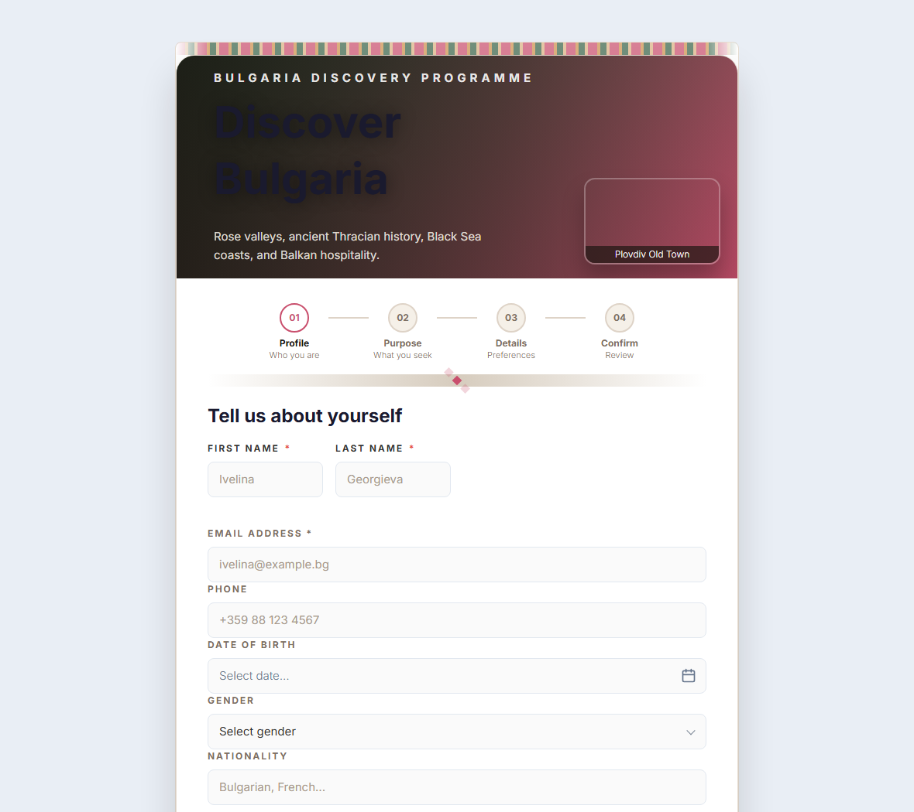
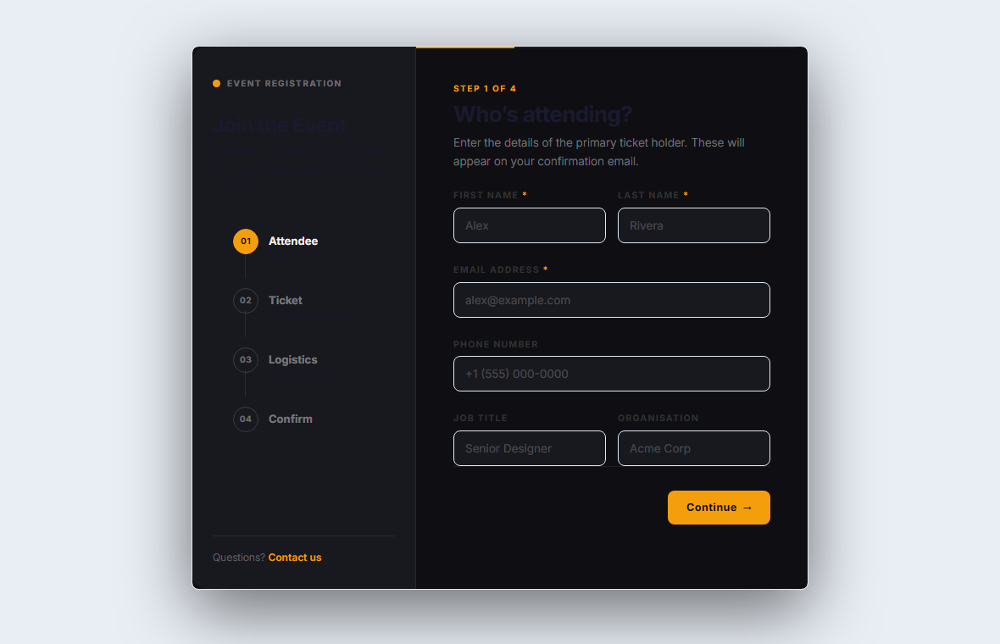

# MegaForm for DNN

**MegaForm** is a complete form platform for **DNN (DotNetNuke)**: a visual builder, ready-made
premium templates, an AI form designer, submissions with analytics, approval workflows, direct
read/write to your own SQL tables, and a Razor/SDK surface — all inside your own DNN portal, on
your own database.

> This site covers **MegaForm on DNN specifically**. For the Oqtane edition see the
> [Oqtane documentation](https://cisssolution.github.io/MegaformDocs/).

## A form module doesn't look like a form builder

A MegaForm module should look like a designed page, not like the builder UI. The templates below
ship in the box and are rendered live on the DNN QA site — premium themes with multi-step chips,
hero panels, cards and styled inputs included.

## More gallery templates

These full-form screenshots show different layout styles from the same gallery: tabbed account
setup, health intake, onboarding flows, travel programmes and event registration.

## Product areas

MegaForm also includes the dashboard, submissions analytics, an approval inbox, a visual BPMN
workflow designer, storage integrations, widgets, multi-language forms, AI-assisted form creation,
and DNN-specific SQL-table binding and Razor rendering. Start with the guides below.

## Start here

**[Guides](articles/dnn-creating-forms.md) — using MegaForm on DNN:**

| Guide | What it covers |
|-------|----------------|
| [Creating Forms](articles/dnn-creating-forms.md) | Wizard, multi-step, and AI flows — with demo animations |
| [Create a Form with AI](articles/dnn-ai-create-form.md) | Describe a form in the Dashboard; AI builds a premium form |
| [Form Builder](articles/dnn-form-builder.md) | The visual builder in depth |
| [Module Settings & Theme](articles/dnn-settings-theme.md) | Choose the form a page shows; presets, colors, layout |
| [Theme Compatibility](articles/dnn-theme-compatibility.md) | Keep MegaForm styling or inherit the DNN page skin |
| [Submissions & My Inbox](articles/dnn-submissions-inbox.md) | Analytics, data grids, statuses, the approval inbox |
| [Read & Write a SQL Table](articles/dnn-sql-table.md) | Point MegaForm at a real table and build a form from its columns |
| [Cascade-SQL Dropdowns](articles/cascade-sql-dropdowns.md) | Parent → child dropdowns that read from SQL |
| [Display Submissions with Razor](articles/dnn-razor-display-submissions.md) | Card, ListView and detail layouts over your form data |

**[Programming (SDK)](programming/overview.md) — read & write from your own code:**

| Guide | What it covers |
|-------|----------------|
| [Overview](programming/overview.md) | Architecture, key concepts, the object model |
| [Installation](programming/installation.md) | Add the SDK and register it in your host |
| [Standalone Host](programming/standalone-host.md) | Run MegaForm as an ASP.NET Core app via NuGet |
| [Quick Start](programming/quickstart.md) | A working list view in ~20 lines |
| [SDK Reference](programming/sdk-reference.md) | Complete English reference for every SDK API |
| [Reading data](programming/reading-data.md) | Forms and submissions queries, paging, scope |
| [File download](programming/file-download.md) | List and stream uploaded files safely |
| [DNN Razor Host](programming/dnn-razor-host.md) | Consume MegaForm data from a DNN Razor Host script |

> Prerequisites: DNN 10.x, MegaForm module installed, and Host/Administrator access.
